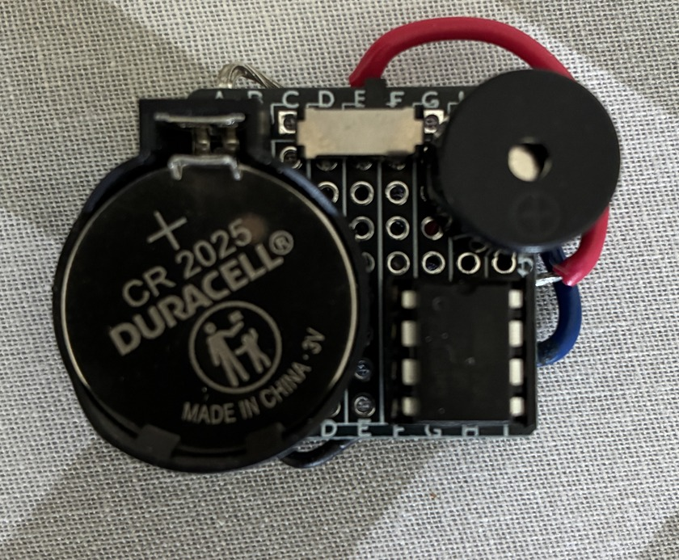

# Annoyatron – Multi-Mode
A low-power "Annoyatron"-style device built around an ATtiny85 microcontroller with support for multiple modes.  
It emits short periodic beeps at random intervals, powered by a coin cell battery, with a DPDT switch to change modes.

## Hardware
See [`docs/bom.md`](docs/bom.md) and [`docs/wiring.md`](docs/wiring.md) for component list and wiring diagram.  
- ATtiny85 (8-pin DIP) + socket  
- **TMB12A03 speaker** (3V magnetic speaker - see note below)
- Coin cell holder + CR2032/2025/2016 battery  
- Small protoboard  
- DPDT slide switch  

**Important Speaker Note:** This code was developed specifically using the TMB12A03 3V magnetic speaker. If you use a different speaker (piezo buzzer, different impedance, or voltage rating), you will likely need to adjust these values in the code to achieve the desired tone, pitch, and volume.

## Usage
1. Flash the `annoyatron_multi.ino` sketch onto the ATtiny85.  
2. Insert into DIP socket on your board.  
3. Wire battery, speaker, and DPDT switch as shown in [`docs/wiring.md`](docs/wiring.md).  
4. Power on → device will give 3 quick startup beeps.  
5. Use the DPDT switch to select mode:  
   - **Left position** → Simple beep mode  
   - **Middle position** → Device completely off  
   - **Right position** → Variety mode
