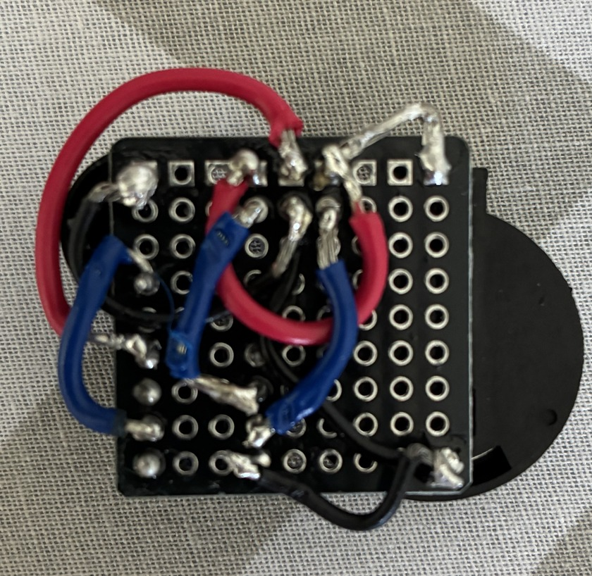

# Wiring

This section provides a complete wiring reference for the Annoyatron clone build. The image below shows how the components are connected, while the tables that follow break down each pin, button terminal, and function in detail.

## Component Connections
| Component   | Terminal/Pin     | Connection To                                   |
|-------------|------------------|-------------------------------------------------|
| **ATtiny85** | Pin 1 (RESET)   | NC                                   |
|             | Pin 2 (PB3)      | One side of tactile button                      |
|             | Pin 3 (PB4)      | NC                                   |
|             | Pin 4 (GND)      | Battery Negative, Speaker Negative, other side of tactile button |
|             | Pin 5 (PB0)      | NC                                   |
|             | Pin 6 (PB1)      | Speaker Positive                                |
|             | Pin 7 (PB2)      | NC                                   |
|             | Pin 8 (VCC)      | Battery Positive                                |

## Tactile Button
| Terminal    | Connection To             |
|-------------|---------------------------|
| One side    | ATtiny85 PB3 (pin 2)      |
| Other side  | ATtiny85 GND (pin 4)               |

## Speaker
| Terminal    | Connection To             |
|-------------|---------------------------|
| Positive (+)| ATtiny85 PB1 (pin 6)      |
| Negative (–)| ATtiny85 GND (pin 4)      |

## Battery
| Terminal    | Connection To             |
|-------------|---------------------------|
| Positive (+)| ATtiny85 VCC (pin 8)      |
| Negative (–)| ATtiny85 GND (pin 4)      |
